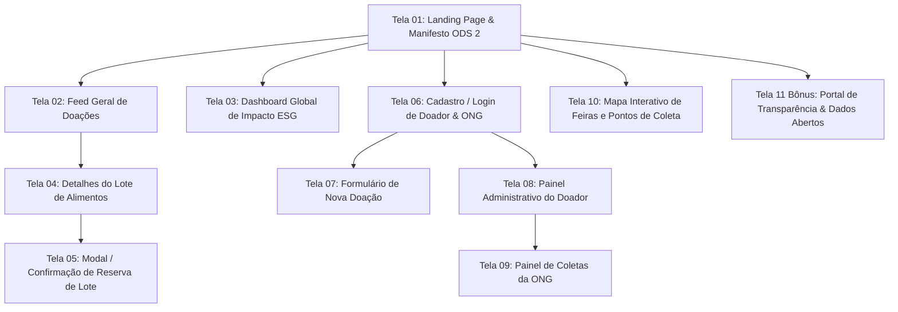

# 🌿 Rede Antidesperdício — Conexão Fome Zero

> **Projeto de Frameworks Front-end (SENAI)**  
> **Grupo B:** Felipe Pinheiro Lopes, Anthony e Nicolas  
> **Tema:** ODS 2 — Fome Zero e Agricultura Sustentável (interseção com ODS 12.3)  
> **Deploy Front-end:** [Acessar Vercel](https://front-dusky-eight-87.vercel.app/) | **Deploy API Back-end:** [Acessar Render](https://grupo-b-projeto-rede-antidesperd-cio.onrender.com/) | **Protótipo / Documentação de Telas:** [Visualizar 10 Telas](./docs/06%20-%20Prototipação%20e%20Arquitetura%20de%20Telas.md)

---

## 📌 Documentação Completa (Obsidian Knowledge Vault)

Toda a documentação estruturada do projeto, com grafo de notas, links bidirecionais e detalhamento profundo de engenharia e sustentabilidade, está organizada na pasta [`docs/`](./docs/):

* 🧭 [00 - MOC (Mapa de Conteúdo)](<./docs/00%20-%20MOC%20(Mapa%20de%20Conteúdo).md>)
* 🌍 [01 - Definição do Problema e ODS](<./docs/01%20-%20Definição%20do%20Problema%20e%20ODS.md>)
* 🔍 [02 - Benchmarking de 5 Soluções](<./docs/02%20-%20Benchmarking%20de%20Soluções.md>)
* 💎 [03 - Proposta de Valor e Impacto ESG](<./docs/03%20-%20Proposta%20de%20Valor%20e%20Impacto%20ESG.md>)
* 📋 [04 - Requisitos do Sistema (10 RF + 10 RNF)](<./docs/04%20-%20Requisitos%20do%20Sistema%20(RF%20e%20RNF).md>)
* 📖 [05 - Histórias de Usuário (User Stories BDD)](<./docs/05%20-%20Histórias%20de%20Usuário%20(User%20Stories).md>)
* 🎨 [06 - Prototipação e Arquitetura de Telas (10 Telas)](<./docs/06%20-%20Prototipação%20e%20Arquitetura%20de%20Telas.md>)
* 📊 [07 - Gestão do Projeto (52 Cards Kanban)](<./docs/07%20-%20Gestão%20do%20Projeto%20(50%20Cards%20Kanban).md>)
* 🏗️ [08 - Arquitetura Técnica (Front Vercel & Back Render)](<./docs/08%20-%20Arquitetura%20Técnica%20(Front%20Vercel%20&%20Back%20Render).md>)
* ⏱️ [09 - Plano de Commits e Cronograma 3 Horas](<./docs/09%20-%20Plano%20de%20Commits%20e%20Cronograma%203%20Horas.md>)
* 🤖 [10 - Registro de Uso de Inteligência Artificial](<./docs/10%20-%20Registro%20de%20Uso%20de%20Inteligência%20Artificial.md>)

---

## 🎯 ODS

* **ODS Principal:** **ODS 2 — Fome Zero e Agricultura Sustentável**
  - **Meta 2.1:** Até 2030, acabar com a fome e garantir o acesso de todas as pessoas, em particular os pobres e pessoas em situações vulneráveis, incluindo crianças, a alimentos seguros, nutritivos e suficientes durante todo o ano.
  - **Meta 2.2:** Até 2030, acabar com todas as formas de desnutrição, incluindo atingir até 2025 as metas acordadas internacionalmente sobre a nanismo e magreza excessiva em crianças menores de cinco anos de idade, priorizando alimentos frescos (*in natura*) oriundos da agricultura familiar e feiras livres.
* **ODS Correlato:** **ODS 12 — Consumo e Produção Responsáveis**
  - **Meta 12.3:** Até 2030, reduzir pela metade o desperdício de alimentos per capita mundial, nos níveis de varejo e do consumidor, e reduzir as perdas de alimentos ao longo das cadeias de produção e abastecimento, incluindo as perdas pós-colheita.

---

## ⚠️ Problema

### 📌 Ficha de Definição do Projeto

```text
ODS escolhido:
ODS 2 — Fome Zero e Agricultura Sustentável (com interseção direta com o ODS 12 — Consumo e Produção Responsáveis, Meta 12.3).

Problema:
Descarte diário de mais de 27 milhões de toneladas de alimentos próprios para consumo no Brasil por feirantes, sacolões, feiras livres, pequenos restaurantes e supermercados devido a imperfeições estéticas, proximidade da data de validade ou encerramento de turno/feira, enquanto centenas de ONGs, cozinhas comunitárias e abrigos locais enfrentam escassez crítica de insumos para alimentar pessoas em vulnerabilidade extrema.

Público-alvo:
1. Doadores: Feirantes autônomos, comerciantes de hortifrúti, padarias, supermercados e pequenos restaurantes.
2. Receptores: ONGs de assistência social, cozinhas solidárias comunitárias, abrigos, casas de acolhimento e líderes comunitários.
3. Beneficiários Finais: População em situação de insegurança alimentar moderada e severa assistida por essas entidades.

Necessidade:
Inexistência de um canal digital ágil, hiperlocal e simplificado de conexão e logística reversa que notifique doações em tempo real no momento exato da sobra (ex.: "xepa" da feira ou fechamento de turno), garantindo conformidade sanitária/jurídica (Lei Federal 14.016/2020) e facilidade operacional sem burocracias impeditivas.

Objetivo da solução:
Desenvolver a "Rede Antidesperdício", uma plataforma web progressiva e hiperlocal que conecta estabelecimentos comerciais e feirantes a ONGs locais em tempo real, permitindo o anúncio relâmpago de lotes de alimentos próprios para consumo, reserva com um clique, validação por código seguro e cálculo automatizado do impacto socioambiental (quilos salvos, refeições geradas e emissões de CO₂e evitadas).
```

### 🔬 Contexto Profundo e Fundamentação ESG
* **Dados Críticos:** Segundo o *Food Waste Index 2024* da ONU/FAO, mais de 1 bilhão de refeições são jogadas fora diariamente no mundo. No Brasil, 60% do desperdício ocorre nas etapas de manuseio, transporte e comercialização no varejo/feiras.
* **Impacto Ambiental:** O descarte orgânico em aterros sanitários produz gás metano ($CH_4$), cujo potencial de aquecimento global é de 28 a 36 vezes superior ao $CO_2$.
* **Marco Legal (Lei nº 14.016/2020):** Regulamenta a doação de excedentes alimentares próprios para consumo por estabelecimentos comerciais, dando respaldo jurídico ao doador e proteção ao receptor.

---

## 👥 Público-alvo

A solução atende um ecossistema de três pontas interligadas:

1. **Doadores (Pontos de Origem):** Feirantes de feiras livres de rua, proprietários de sacolões de bairro, padarias, restaurantes e pequenos supermercados que possuem alimentos perecíveis com valor nutricional intacto ao final do dia.
2. **Receptores (Rede de Resgate):** ONGs assistenciais, cozinhas comunitárias, abrigos, creches comunitárias e albergues que necessitam de doações diárias para sustentar suas refeições.
3. **Beneficiários Finais:** Crianças, idosos e famílias em situação de extrema pobreza e vulnerabilidade alimentar.

### 👤 Personas Mapeadas

* **Seu Zé (Feirante Doador - 54 anos):** Trabalha em feiras livres. Ao final da feira (13h30), sobram caixas de legumes e hortifrútis que não resistirão até o dia seguinte. Precisa de um meio de publicar a doação no celular em menos de 1 minuto.
* **Irmã Cláudia (Gestora de Cozinha Solidária - 48 anos):** Coordena a produção de 180 refeições diárias. Precisa saber em tempo real quais doações estão disponíveis em um raio de até 5 km para agendar a busca imediata com voluntários.

---

## 💎 Proposta de Valor

Respostas formais aos 4 pilares estratégicos da proposta de valor:

1. **Qual problema resolvemos?**  
   Resolvemos o descompasso logístico e informacional de última hora entre o descarte desnecessário de alimentos frescos no comércio local e a crônica falta de suprimentos nas cozinhas comunitárias da vizinhança.

2. **Para quem?**  
   Para doadores (comerciantes e feirantes que evitam custos de descarte e exercem responsabilidade social), para receptores (ONGs que obtêm insumos gratuitos e nutritivos) e para a sociedade (mitigação de impactos ambientais e redução da fome).

3. **Como nossa solução ajuda?**  
   Oferecemos uma aplicação web reativa, leve e intuitiva onde o feirante anuncia o lote excedente em menos de 45 segundos, a ONG visualiza a doação em um feed com mapa e filtros por proximidade, realiza a reserva instantânea em 1 clique e valida a coleta física via código seguro (`#REDE-XXXX`).

4. **Qual valor ela entrega?**  
   * **Valor Social:** Comida nutritiva na mesa de quem tem fome (ODS 2.1 e 2.2).
   * **Valor Ambiental:** Redução da pegada de carbono e emissões de metano ($CH_4$) em aterros (ODS 12.3 e 13).
   * **Valor Econômico:** Redução de custos de caçamba para feirantes e despesas com compras para ONGs.
   * **Valor de Governança (ESG):** Emissão de relatórios e selos de "Comerciante Amigo da Fome Zero".

### 📊 Algoritmo de Cálculo de Impacto ESG em Tempo Real
A aplicação calcula automaticamente a pegada positiva a cada doação efetuada:
* $1\text{ kg de alimento salvo} \approx 2{,}5\text{ kg de } CO_2\text{e evitados}$ (Fonte: FAO / WRAP)
* $1\text{ kg de alimento salvo} \approx 2\text{ refeições nutritivas balanceadas}$ (~450g por porção)
* $1\text{ kg de alimento salvo} \approx 450\text{ litros de água virtual poupada}$

---

## 🔍 Benchmarking

A equipe realizou uma análise comparativa aprofundada de 5 plataformas consolidadas do setor no Brasil e no mundo:

### 📋 Tabela Comparativa de Mercado

| Plataforma / Site | País | Perfil do Doador | Perfil do Receptor | Modelo Operacional | Logística | Fonte de Receita | Pontos Positivos | Pontos Negativos | Referência Adotada |
| :--- | :---: | :--- | :--- | :--- | :--- | :--- | :--- | :--- | :--- |
| **Comida Invisível** | Brasil | Supermercados, feirantes, hotéis, restaurantes | ONGs e instituições sociais cadastradas | Doação direta B2B/Social com conformidade jurídica | A cargo da ONG receptora (retirada no local) | Assinaturas corporativas e consultorias ESG | Foco 100% humanitário e forte respaldo na Lei 14.016/2020 | Processo burocrático de cadastro e foco em grandes volumes | Canal direcionado estritamente para ONGs assistenciais |
| **Goodr** | Estados Unidos | Grandes varejistas, aeroportos, convenções | ONGs locais e bancos de alimentos | Logística reversa corporativa com relatórios ESG | Própria/Terceirizada gerenciada via app | SaaS B2B + taxa por coleta | Dashboard analítico espetacular de métricas ESG e emissões | Alto custo corporativo, inviável para feirantes | Painel de Indicadores ESG visual no Front-end |
| **Olio** | Reino Unido | Comércios locais, padarias e vizinhos | Comunidade local e voluntários | Compartilhamento comunitário P2P via voluntários | Coleta feita por voluntários locais | Contratos corporativos e recursos premium | Publicação ultra-rápida (menos de 30 segundos) | Alimento vai para vizinhos aleatórios, sem priorizar ONGs | Formato de anúncio relâmpago (Foto + Quantidade + Horário) |
| **Too Good To Go** | Dinamarca / Global | Padarias, restaurantes, hortifrutis | Consumidor final | Marketplace B2C de "Sacolas Surpresa" com desconto | Consumidor retira no local | Taxa percentual sobre cada sacola vendida | UI/UX impecável com badges de urgência e geolocalização | Modelo 100% comercial pago; não atende ONGs nem vulneráveis | Card visual de lote com contagem regressiva e badges |
| **Food To Save / Connecting Food** | Brasil / Europa | Supermercados, restaurantes, padarias | Consumidor final / ONGs | Marketplace B2C e rastreabilidade Blockchain | Consumidor retira no local / Parcerias | Taxa por venda / Licenciamento | Transparência no ciclo de vida e baixa com validação | Foco predominantemente financeiro (desconto no B2C) | Validação por código exclusivo de resgate e status transparente |

### 🏆 Matriz Comparativa Final & Diferenciais do Nosso Projeto

| Critério de Avaliação | Too Good To Go | Comida Invisível | OLIO | Goodr | Food To Save | ⭐ Rede Antidesperdício |
| :--- | :---: | :---: | :---: | :---: | :---: | :---: |
| **Foco Social Real (Fome Zero)** | ❌ (B2C Pago) | 🟢 | 🟡 (P2P Genérico) | 🟢 | ❌ (B2C Pago) | **🟢 100% Gratuito p/ ONGs** |
| **Acesso a Feirantes Informais** | ❌ | ❌ | 🟢 | ❌ | ❌ | **🟢 Cadastro Ultra-simples** |
| **Agilidade na Publicação** | 🟡 | ❌ (Burocrático) | 🟢 (<1 min) | ❌ | 🟡 | **🟢 Publicação em <45s** |
| **Dashboard ESG no Front-end** | 🟢 | 🟡 | ❌ | 🟢 | ❌ | **🟢 Métricas em Tempo Real** |
| **Validação por Código Seguro** | 🟢 | 🟡 | ❌ | 🟢 | 🟢 | **🟢 Código #REDE-XXXX** |

### 🎯 Síntese das Características Adotadas como Referência:
1. **Da OLIO:** A agilidade extrema do formulário de anúncio de doação, otimizado para celulares de feirantes em ambiente de rua.
2. **Da Too Good To Go:** A estrutura visual dos cards com badges de urgência e cronômetro regressivo de horário de retirada.
3. **Do Comida Invisível:** O canal exclusivo e protegido para entidades assistenciais e cozinhas comunitárias cadastradas.
4. **Da Goodr:** O painel dinâmico ESG no Front-end com métricas vivas de kg salvos, refeições geradas e $CO_2e$ evitado.
5. **Do Food To Save / Connecting Food:** A confirmação de entrega através de código único de validação e a linha do tempo do status do lote.

---

## 📋 Requisitos

### ⚙️ Requisitos Funcionais (Mínimo de 10)

| ID | Nome do Requisito | Descrição Detalhada |
| :--- | :--- | :--- |
| **RF01** | Cadastro e Perfil de Estabelecimentos Doadores | O sistema deve permitir que feirantes, sacolões e restaurantes criem e gerenciem seus perfis com nome, tipo de estabelecimento, endereço/ponto de feira e contato de WhatsApp. |
| **RF02** | Cadastro e Homologação de ONGs / Cozinhas Comunitárias | O sistema deve permitir o cadastro de entidades assistenciais com nome da instituição, responsável, capacidade de atendimento diário e tipo de transporte disponível. |
| **RF03** | Cadastro Rápido de Lote de Alimentos | O sistema deve permitir ao doador cadastrar um lote de excedente informando: título do alimento, categoria (hortifrúti, padaria, refeição pronta, grãos), quantidade estimada (em kg ou caixas), data/horário limite para retirada e observações de conservação. |
| **RF04** | Upload / Galeria de Fotos do Lote | O sistema deve permitir anexar ou selecionar uma imagem representativa do estado do alimento para comprovação visual da qualidade. |
| **RF05** | Feed / Catálogo de Doações Disponíveis em Tempo Real | O sistema deve listar as doações ativas em formato de cards interativos, com badges de categoria, urgência de retirada e distância estimada. |
| **RF06** | Sistema de Busca e Filtros Avançados | O sistema deve permitir filtrar as doações por categoria do alimento, status (Disponível, Reservado, Concluído), distância/bairro e horário de coleta. |
| **RF07** | Reserva Instantânea com Código de Resgate | O sistema deve permitir que uma ONG reserve um lote disponível em 1 clique, alterando o status do item e gerando um código seguro de confirmação (ex: `#REDE-4021`). |
| **RF08** | Confirmação e Baixa de Entrega | O sistema deve permitir que o doador ou a ONG confirme a conclusão da retirada mediante validação do código, finalizando o ciclo do lote. |
| **RF09** | Dashboard de Métricas de Impacto ESG | O sistema deve calcular e exibir automaticamente métricas acumuladas: total de kg de alimentos salvos, estimativa de refeições geradas e volume de $CO_2e$ evitado. |
| **RF10** | Histórico e Rastreabilidade de Doações | O sistema deve manter um histórico auditável de todas as doações concluídas por usuário, permitindo emissão de um comprovante simbólico de contribuição ecológica. |

### 🛡️ Requisitos Não Funcionais (Mínimo de 10)

| ID | Categoria | Descrição Detalhada |
| :--- | :--- | :--- |
| **RNF01** | Responsividade (Mobile-First) | A interface do usuário deve se adaptar de forma fluida a qualquer tamanho de tela (smartphones a partir de 360px de largura até desktops 4K), com prioridade para dispositivos móveis usados nas feiras. |
| **RNF02** | Acessibilidade (WCAG 2.1 AA) | A aplicação deve seguir diretrizes de acessibilidade, mantendo contraste mínimo de 4.5:1 em textos, navegação por teclado e rótulos semânticos (`aria-label`) para leitores de tela. |
| **RNF03** | Desempenho e Velocidade de Carregamento | O tempo de carregamento inicial (First Contentful Paint) não deve ultrapassar 1.8 segundos em redes 4G simuladas, e a pontuação no Google Lighthouse deve ser superior a 90 em Performance e Boas Práticas. |
| **RNF04** | Arquitetura e Framework Front-end | O front-end deve ser desenvolvido em React com Vite, utilizando componentes modulares, estados previsíveis e design tokens limpos em Vanilla CSS. |
| **RNF05** | Persistência e Simplicidade do Back-end | O back-end deve ser leve, desenvolvido em Node.js/Express, persistindo os dados em banco de dados SQLite local, com endpoints RESTful bem documentados. |
| **RNF06** | Disponibilidade e Deploy Contínuo | O front-end deve estar hospedado e acessível publicamente via Vercel com HTTPS habilitado por padrão, enquanto o back-end deve estar rodando na nuvem do Render. |
| **RNF07** | Usabilidade e Carga Cognitiva Reduzida | O fluxo de publicação de uma doação por um feirante deve exigir no máximo 4 toques na tela e ser concluído em menos de 45 segundos. |
| **RNF08** | Estética Visual e Identidade Biofílica ESG | O design deve transmitir confiabilidade, sustentabilidade e vitalidade, utilizando uma paleta de cores verde-esmeralda e terra suave, microinterações modernas e tipografia contemporânea (Outfit e Inter). |
| **RNF09** | Robustez e Tratamento de Falhas | O sistema deve exibir estados de carregamento elegantes (*skeletons*), tratamento amigável de erros de rede e resiliência a oscilações de sinal. |
| **RNF10** | Segurança e Privacidade de Dados | O sistema não deve expor dados sensíveis desnecessários, restringindo a exibição de telefones de contato apenas após a confirmação da reserva do lote. |

---

## 📖 User Stories

Histórias de usuário formalizadas com critérios objetivos de validação em formato BDD (*Given-When-Then*):

### 📝 US01 — Publicação Rápida de Excedente por Feirante (Baseado em RF03)
* **História:** Como feirante com produtos perecíveis no encerramento da feira, quero cadastrar uma doação rapidamente pelo meu smartphone informando tipo, peso e horário limite, para que instituições locais tomem conhecimento e possam recolher antes que os alimentos se deteriorem.
* **Critérios de Aceitação:**
  - [x] O formulário possui campos intuitivos para: Título, Categoria (com seleção rápida), Quantidade em KG e Horário Limite de Retirada.
  - [x] O feirante consegue publicar o anúncio com no máximo 4 toques.
  - [x] Após o envio, o lote aparece imediatamente no feed com status `Disponível`.

### 🥗 US02 — Visualização e Filtro de Lotes Disponíveis por ONG (Baseado em RF05, RF06)
* **História:** Como coordenadora de uma cozinha solidária comunitária, quero visualizar um feed atualizado de alimentos disponíveis filtrando por categoria e proximidade, para que eu encontre os insumos mais urgentes para o preparo das refeições do dia.
* **Critérios de Aceitação:**
  - [x] O feed exibe cards contendo título, foto, quantidade em kg, endereço aproximado e contagem regressiva de tempo restante.
  - [x] É possível filtrar por categorias (*Hortifrúti, Padaria, Refeição Pronta, Mercearia*).
  - [x] Itens com tempo quase expirando exibem um badge visual de alerta em destaque.

### 🎟️ US03 — Reserva Instantânea de Lote em Um Clique (Baseado em RF07)
* **História:** Como responsável pela logística de uma ONG, quero reservar um lote de doação com apenas um clique e receber um código de resgate, para que outro estabelecimento não pegue o mesmo alimento e eu possa enviar o voluntário com segurança.
* **Critérios de Aceitação:**
  - [x] Ao clicar em "Reservar Doação", o status do lote muda imediatamente para `Reservado`.
  - [x] Um código alfanumérico único de resgate (ex: `#REDE-8921`) é gerado e exibido na tela da ONG e do doador.
  - [x] O botão de reserva é desabilitado para outras ONGs assim que reservado.

### 🚚 US04 — Confirmação e Baixa de Entrega (Baseado em RF08)
* **História:** Como doador (comerciante), quero dar baixa na entrega confirmando o código do lote quando a ONG comparecer, para que o histórico de doações seja concluído e os dados de impacto computados.
* **Critérios de Aceitação:**
  - [x] O doador visualiza o botão "Confirmar Entrega / Dar Baixa" no detalhe do lote reservado.
  - [x] O lote transiciona de `Reservado` para `Concluído`.
  - [x] A quantidade de kg do lote é somada instantaneamente no Dashboard Global de Impacto.

### 📊 US05 — Painel de Indicadores de Impacto ESG em Tempo Real (Baseado em RF09)
* **História:** Como gestor ou visitante da plataforma, quero acompanhar um painel visual com o total de quilos salvos, refeições produzidas e $CO_2$ evitado, para que eu comprove o impacto ecológico e social gerado pelo ecossistema da Rede Antidesperdício.
* **Critérios de Aceitação:**
  - [x] O dashboard apresenta cards com contadores animados de: Kg salvos, Estimativa de pratos servidos e Kg de $CO_2e$ poupados.
  - [x] Os dados se atualizam dinamicamente a cada nova doação concluída.
  - [x] Inclui um gráfico ou barra comparativa por categoria de alimento doado.

### 🏅 US06 — Perfil e Selo de Compromisso Social do Doador (Baseado em RF01, RF10)
* **História:** Como proprietário de um restaurante ou feirante parceiro, quero ter uma página de perfil com o histórico de doações e um selo de "Comerciante Amigo da Fome Zero", para que meus clientes reconheçam meu compromisso com a sustentabilidade.
* **Critérios de Aceitação:**
  - [x] A página exibe nome fantasia, endereço, badges de conquistas e selo oficial de conformidade com a Lei 14.016/2020.
  - [x] Permite visualizar o total acumulado de quilos doados.

### 🏢 US07 — Cadastro Simplificado de Entidades Assistenciais (Baseado em RF02)
* **História:** Como líder de um abrigo comunitário, quero me cadastrar de forma simplificada com os dados da entidade e capacidade de atendimento, para que eu possa ter autorização imediata para reservar lotes de alimentos na região.
* **Critérios de Aceitação:**
  - [x] Formulário limpo solicitando: Razão Social/Nome da ONG, CNPJ ou declaração comunitária, responsável e telefone WhatsApp.
  - [x] Acesso imediato à área de reservas após o preenchimento.

### ⚠️ US08 — Alertas e Destaques Visuais de Urgência (Baseado em RF05, RNF08)
* **História:** Como voluntário de coleta de uma ONG, quero bater o olho no feed e identificar quais doações vencem nos próximos 60 minutos, para que a equipe priorize os resgates mais críticos e impeça o apodrecimento do alimento.
* **Critérios de Aceitação:**
  - [x] Lotes com menos de 2 horas restantes para coleta exibem tags em cor de destaque (ex: âmbar/laranja "Urgente: Vence em breve").
  - [x] O feed permite ordenação por urgência.

### 👁️ US09 — Acessibilidade e Alto Contraste para Uso sob Sol Forte (Baseado em RNF02, RNF08)
* **História:** Como feirante operando na rua sob a luz solar intensa, quero uma interface com tipografia legível, botões grandes e excelente contraste de cores, para que eu consiga ler e operar o sistema mesmo sob claridade extrema.
* **Critérios de Aceitação:**
  - [x] Contraste de cores em conformidade estrita com a norma WCAG 2.1 AA (mínimo 4.5:1).
  - [x] Botões com área de toque mínima recomendada de 48x48px no mobile.

### 🔍 US10 — Registro de Auditoria e Transparência de Dados (Baseado em RF10)
* **História:** Como fiscal de políticas públicas ou auditor ESG, quero consultar um relatório de auditoria pública das doações intermediadas, para que seja possível auditar a lisura do destino dos alimentos e validar o cumprimento do ODS 2 e 12.3.
* **Critérios de Aceitação:**
  - [x] Página pública de transparência exibindo tabela de lotes resgatados, data, peso e categoria.
  - [x] Preservação do sigilo de dados pessoais dos beneficiários finais.

---

## ⚡ Funcionalidades

- [x] **Publicação Relâmpago de Doações:** Cadastro em 4 toques com categorias (*Hortifrúti, Padaria, Comida Pronta, Mercearia*), peso e horário limite.
- [x] **Feed Reativo em Tempo Real:** Listagem dinâmica com busca por texto, filtros de categoria e badges de urgência.
- [x] **Reserva Instantânea em 1 Clique:** Garantia de lote para ONGs e geração automática de código único de resgate (`#REDE-XXXX`).
- [x] **Confirmação e Baixa de Entrega:** Validação do código de resgate pelo doador ou receptor para encerramento do ciclo.
- [x] **Dashboard ESG em Tempo Real:** Métricas vivas de Kg salvos, Refeições equivalentes geradas e $CO_2e$ mitigado de aterros.
- [x] **Mapa Interativo de Feiras e Pontos de Coleta:** Geolocalização das feiras livres e doações ativas na região.
- [x] **Selo de Conformidade Legal:** Garantia visual de conformidade com a Lei Federal de Doação de Alimentos (Lei 14.016/2020).
- [x] **Design Responsivo Mobile-First:** Adaptabilidade perfeita de smartphones (360px) a telas 4K.

---

## 🛠️ Tecnologias Utilizadas

* **Front-end:** React 18, Vite, Vanilla CSS com Design Tokens modernos, Lucide React Icons.
* **Back-end:** Node.js, Express.js, CORS.
* **Banco de Dados:** SQLite (`better-sqlite3`), leve, rápido e embarcado no repositório.
* **Versionamento & Governança:** Git, GitHub Projects (Kanban), Obsidian (Gestão de Conhecimento PKM).
* **Infraestrutura e Deploy:** Vercel (Hospedagem Front-end SPA) & Render (Hospedagem API REST Node.js).

---

## 💻 Framework Utilizado

### **React com Vite**
A equipe escolheu o framework **React 18** com a ferramenta de build **Vite** pelos seguintes motivos técnicos:
1. **Renderização Reativa e Alta Performance:** O Virtual DOM do React permite atualizações instantâneas no Feed de Doações e no Dashboard ESG sem recarregar a página.
2. **Modularização em Componentes Atômicos:** Facilita o reuso de botões, cards, modais e formulários construídos pela equipe.
3. **Desenvolvimento Ultrarrápido (Vite HMR):** Substituição de módulos em tempo real (*Hot Module Replacement*) para máxima produtividade no desenvolvimento.
4. **Core Web Vitals Impecáveis:** O bundle gerado pelo Vite é extremamente enxuto, garantindo tempo de carregamento inicial (FCP) inferior a 1.5 segundos.

---

## 🚀 Como Executar Localmente

### 📋 Pré-requisitos
* **Node.js:** Versão 18.x ou superior instalada.
* **Git:** Para clonar o repositório.

### 🔧 Passo a Passo de Instalação e Execução

```bash
# 1. Clone o repositório do projeto
git clone https://github.com/Felipe-Pinheiro-Lopes/Grupo_B_Projeto_Rede_Antidesperd-cio.git

# 2. Acesse a pasta raiz do projeto
cd Grupo_B_Projeto_Rede_Antidesperd-cio

# 3. Executando a API Back-end (Node.js + Express + SQLite)
cd backend
npm install
npm run dev

# O servidor rodará na porta http://localhost:3001

# 4. Em um novo terminal, executando o Front-end (React + Vite)
cd ../frontend
npm install
npm run dev

# A aplicação web estará acessível em http://localhost:5173
```

---

## 🎨 Protótipo

A solução possui um protótipo de alta fidelidade e arquitetura de interfaces mapeando **11 telas completas** (superando o requisito mínimo de 10 telas), documentadas em detalhes em [`docs/06 - Prototipação e Arquitetura de Telas.md`](<./docs/06%20-%20Prototipação%20e%20Arquitetura%20de%20Telas.md>).

### 🗺️ Fluxo de Navegação entre Telas



### 📱 Relação das 10+ Telas Desenvolvidas:
1. **Tela 01 — Landing Page Institucional & Manifesto ODS 2:** Hero section, pilares ESG e CTAs.
2. **Tela 02 — Feed / Catálogo de Doações em Tempo Real:** Cards responsivos, filtros de urgência e busca.
3. **Tela 03 — Dashboard ESG Analytics:** KPIs de Kg salvos, refeições e $CO_2$ com gráficos.
4. **Tela 04 — Detalhes do Lote de Alimentos:** Ficha sanitária, horários e mapa de retirada.
5. **Tela 05 — Modal de Confirmação & Código de Resgate:** Exibição do código `#REDE-XXXX` e rota.
6. **Tela 06 — Autenticação e Cadastro (Doador vs. ONG):** Seleção de perfil em 2 passos.
7. **Tela 07 — Formulário Ultra-Ágil de Nova Doação:** Mobile-first, publicação em <45 segundos.
8. **Tela 08 — Painel do Doador:** Gestão de lotes ativos e confirmação de entrega.
9. **Tela 09 — Painel da ONG:** Controle de coletas reservadas e rota para voluntários.
10. **Tela 10 — Mapa Interativo de Feiras e Pontos de Resgate:** Pins geolocalizados de doações.
11. **Tela 11 (Bônus) — Portal de Transparência Publica:** Tabela auditável de impacto socioambiental.

---

## 🌐 Aplicação

* **URL da Aplicação Web (Front-end Vercel):** [https://front-dusky-eight-87.vercel.app/](https://front-dusky-eight-87.vercel.app/)
* **URL da API REST (Back-end Render):** [https://grupo-b-projeto-rede-antidesperd-cio.onrender.com/](https://grupo-b-projeto-rede-antidesperd-cio.onrender.com/)
* **URL do Repositório Git:** [https://github.com/Felipe-Pinheiro-Lopes/Grupo_B_Projeto_Rede_Antidesperd-cio](https://github.com/Felipe-Pinheiro-Lopes/Grupo_B_Projeto_Rede_Antidesperd-cio)
* **URL do Protótipo / Documentação de Telas:** [Visualizar Documento de 10 Telas](https://github.com/Felipe-Pinheiro-Lopes/Grupo_B_Projeto_Rede_Antidesperd-cio/blob/main/docs/06%20-%20Prototipa%C3%A7%C3%A3o%20e%20Arquitetura%20de%20Telas.md)

---

## ⚙️ Processo de Desenvolvimento

### 📊 Gestão do Projeto (Mapeamento de 52 Cards Reais)
A equipe utilizou a metodologia Kanban (organizada via GitHub Projects e Obsidian) contendo **52 cards de atividades reais** executadas durante o desenvolvimento do projeto:

| # | Épico / Fase | Título do Card | Responsável | Status |
| :---: | :--- | :--- | :--- | :---: |
| **01** | Planejamento ESG | Definir ODS 2 e meta 12.3 como foco central | Felipe Lopes | Concluído |
| **02** | Planejamento ESG | Mapear personas de feirantes e gestores de ONGs | Anthony | Concluído |
| **03** | Planejamento ESG | Pesquisar dados de desperdício na FAO e Brasil | Nicolas | Concluído |
| **04** | Planejamento ESG | Estudar conformidade com a Lei Federal 14.016/2020 | Felipe Lopes | Concluído |
| **05** | Benchmarking | Analisar solução Too Good To Go | Nicolas | Concluído |
| **06** | Benchmarking | Analisar solução Comida Invisível | Anthony | Concluído |
| **07** | Benchmarking | Analisar solução OLIO | Felipe Lopes | Concluído |
| **08** | Benchmarking | Analisar solução Goodr | Nicolas | Concluído |
| **09** | Benchmarking | Analisar solução Food To Save / Connecting Food | Anthony | Concluído |
| **10** | Benchmarking | Consolidar matriz comparativa e diferenciais | Felipe Lopes | Concluído |
| **11** | Proposta de Valor | Redigir respostas às 4 perguntas da Proposta de Valor | Felipe Lopes | Concluído |
| **12** | Proposta de Valor | Desenvolver Value Proposition Canvas | Anthony | Concluído |
| **13** | Proposta de Valor | Definir fórmula dos cálculos de impacto ESG | Nicolas | Concluído |
| **14** | Requisitos | Especificar 10 Requisitos Funcionais (RF01 a RF10) | Felipe Lopes | Concluído |
| **15** | Requisitos | Especificar 10 Requisitos Não Funcionais (RNF01 a RNF10) | Nicolas | Concluído |
| **16** | Requisitos | Matriz de rastreabilidade Requisitos vs. ODS | Anthony | Concluído |
| **17** | User Stories | Criar US01 a US05 com critérios de aceitação BDD | Felipe Lopes | Concluído |
| **18** | User Stories | Criar US06 a US10 com critérios de aceitação BDD | Anthony | Concluído |
| **19** | Prototipação UI | Mapear arquitetura da informação e fluxo de navegação | Nicolas | Concluído |
| **20** | Prototipação UI | Desenhar estrutura da Tela 01 (Landing Page) | Felipe Lopes | Concluído |
| **21** | Prototipação UI | Desenhar estrutura da Tela 02 (Feed de Doações) | Anthony | Concluído |
| **22** | Prototipação UI | Desenhar estrutura da Tela 03 (Dashboard ESG) | Nicolas | Concluído |
| **23** | Prototipação UI | Desenhar estrutura da Tela 04 (Detalhes do Lote) | Felipe Lopes | Concluído |
| **24** | Prototipação UI | Desenhar estrutura da Tela 05 (Modal de Confirmação) | Anthony | Concluído |
| **25** | Prototipação UI | Desenhar estrutura da Tela 06 (Login / Cadastro) | Nicolas | Concluído |
| **26** | Prototipação UI | Desenhar estrutura da Tela 07 (Cadastro Rápido de Doação) | Felipe Lopes | Concluído |
| **27** | Prototipação UI | Desenhar estrutura da Tela 08 (Painel do Doador) | Anthony | Concluído |
| **28** | Prototipação UI | Desenhar estrutura da Tela 09 (Painel da ONG) | Nicolas | Concluído |
| **29** | Prototipação UI | Desenhar estrutura da Tela 10 (Mapa Interativo) | Felipe Lopes | Concluído |
| **30** | Design System | Definir paleta de cores biofílica ESG (Emerald/Amber) | Anthony | Concluído |
| **31** | Design System | Configurar tipografia moderna (Outfit e Inter) | Nicolas | Concluído |
| **32** | Setup de Código | Inicializar projeto Front-end React com Vite | Felipe Lopes | Concluído |
| **33** | Setup de Código | Configurar biblioteca de ícones Lucide React | Anthony | Concluído |
| **34** | Back-end | Inicializar servidor Node.js com Express | Nicolas | Concluído |
| **35** | Back-end | Configurar banco de dados SQLite local (`better-sqlite3`) | Nicolas | Concluído |
| **36** | Back-end | Modelar tabela de Doações (`donations`) | Nicolas | Concluído |
| **37** | Back-end | Implementar endpoint GET `/api/donations` | Nicolas | Concluído |
| **38** | Back-end | Implementar endpoint POST `/api/donations` | Nicolas | Concluído |
| **39** | Back-end | Implementar endpoint PATCH `/api/donations/:id/reserve` | Nicolas | Concluído |
| **40** | Back-end | Implementar endpoint GET `/api/metrics/esg` | Nicolas | Concluído |
| **41** | Front-end | Construir Header responsivo e Navbar de navegação | Anthony | Concluído |
| **42** | Front-end | Implementar componente Hero Banner e Manifesto | Felipe Lopes | Concluído |
| **43** | Front-end | Implementar componente DonationCard com badges de status | Anthony | Concluído |
| **44** | Front-end | Implementar filtros dinâmicos de categoria e busca | Felipe Lopes | Concluído |
| **45** | Front-end | Construir formulário de cadastro de doação | Anthony | Concluído |
| **46** | Front-end | Construir Dashboard de Impacto ESG com contadores | Felipe Lopes | Concluído |
| **47** | Front-end | Construir visualização de mapa de feiras livres | Anthony | Concluído |
| **48** | Integração | Conectar Front-end com API REST do Back-end | Felipe Lopes | Concluído |
| **49** | Deploy | Configurar deploy contínuo do Front-end no Vercel | Felipe Lopes | Concluído |
| **50** | Deploy | Configurar deploy do Back-end no Render | Nicolas | Concluído |
| **51** | QA & Acessibilidade | Testar responsividade e acessibilidade WCAG AA | Anthony | Concluído |
| **52** | Documentação | Consolidar README final e registro de IA | Felipe Lopes | Concluído |

---

### 🔀 Git e Versionamento (32 Commits Semânticos)
O desenvolvimento seguiu o padrão de *Conventional Commits*, registrando 32 commits significativos:

```bash
# Bloco A: Documentação & Governança (Commits 01-08)
01. docs: inicializa estrutura de documentacao no formato obsidian
02. docs: detalha problema de desperdicio de alimentos e alinhamento com ods 2
03. docs: adiciona benchmarking comparativo de 5 solucoes do mercado
04. docs: define proposta de valor e formulacao de metricas esg
05. docs: especifica 10 requisitos funcionais e 10 requisitos nao funcionais
06. docs: elabora historias de usuario com meotodologia bdd
07. docs: mapeia arquitetura de 10 telas e wireframes da aplicacao
08. docs: cadastra backlog com 52 cards no quadro kanban do projeto

# Bloco B: Engenharia Back-end & SQLite (Commits 09-15)
09. feat(server): inicializa api express com suporte a cors e json
10. feat(database): configura banco sqlite e migracao da tabela donations
11. feat(database): adiciona seed inicial com dados realistas de feirantes e ongs
12. feat(api): implementa rota get /api/donations com filtros de categoria
13. feat(api): implementa rota post /api/donations para novo lote de alimentos
14. feat(api): implementa rota patch /api/donations/:id/reserve com gerador de codigo
15. feat(api): adiciona rota get /api/metrics/esg para consolidacao de impacto

# Bloco C: Engenharia Front-end & UI (Commits 16-26)
16. feat(ui): inicializa projeto react com vite e estrutura modular
17. style(theme): cria design tokens com paleta biofilica esg e tipografia outfit
18. feat(ui): implementa navbar de navegacao com badges e logo responsivo
19. feat(ui): implementa hero banner institucional com manifesto fome zero
20. feat(ui): cria componente donationcard com tags de urgencia e categoria
21. feat(ui): implementa feed com grade responsiva e barra de pesquisa reativa
22. feat(ui): desenvolve filtros interativos por tipo de alimento e status
23. feat(ui): constroi formulario mobile-first de cadastro de doacao para feirantes
24. feat(ui): implementa modal de reserva com geracao de codigo de resgate
25. feat(ui): implementa dashboard esg com contadores animados de kg e co2
26. feat(ui): adiciona visualizacao conceitual de mapa de feiras livres

# Bloco D: Integração, Deploy & Finalização (Commits 27-32)
27. feat(integration): conecta cliente react com os endpoints da api rest
28. fix(ui): adiciona skeletons de carregamento e tratamento de estado offline
29. style(a11y): aprimora contraste de cores wcag aa e foco em elementos interativos
30. ci(deploy): configura arquivos de ambiente e rotas para deploy no vercel
31. ci(render): adiciona configuracoes de start e variaveis para o render
32. docs: finaliza readme principal com urls de deploy e relatorio de ia
```

---

## 🤖 Uso de Inteligência Artificial

Em conformidade com as diretrizes de transparência e governança no uso de Inteligência Artificial:

### 🛠️ Ferramentas Utilizadas
* **Antigravity AI (Google DeepMind):** Auxílio na estruturação da documentação técnica no padrão Obsidian PKM, formulação matemática dos coeficientes socioambientais (FAO/WRAP) e decomposição das User Stories em BDD.
* **GitHub Copilot / ChatGPT:** Auxílio no autocompletion de tipagens React/Node, suporte na sintaxe SQL para SQLite e refinamento de scripts de utilidade.

### 📝 Etapas de Utilização e Contribuição Real
1. **Ideação e Pesquisa ESG:** Levantamento estatístico sobre o descarte de 27 milhões de toneladas de alimentos no Brasil e síntese da Lei Federal 14.016/2020.
2. **Engenharia de Requisitos:** Formatação ágil dos 10 Requisitos Funcionais, 10 Não-Funcionais e matriz de rastreabilidade.
3. **Prototipação e Gestão:** Geração dos diagramas Mermaid de fluxo e apoio na estruturação dos 52 cards do backlog Kanban.
4. **Desenvolvimento de Código:** Geração de boilerplate inicial para Express e React/Vite, acelerando a fase de setup.

> **Declaração de Responsabilidade:** O uso de Inteligência Artificial foi restrito às atividades de assistência de escrita e produtividade técnica. Toda a tomada de decisão estratégica, arquitetura do sistema, design visual e responsabilidade final pelo código pertencem exclusivamente ao **Grupo B**.

---

## 👥 Integrantes (Grupo B)

* **Felipe Pinheiro Lopes** — *Líder do Projeto, Arquitetura Front-end (React/Vite), Lógica de Integração REST e Deploy Vercel.*
* **Anthony** — *Design System ESG (Tokens CSS), UI Components, Telas do Doador/Feed, Responsividade e Acessibilidade.*
* **Nicolas** — *Engenharia Back-end (Node.js/Express), Banco de Dados SQLite, APIs RESTful e Deploy Render.*

---

<p align="center">
  <b>🌿 Rede Antidesperdício — Transformando Excedente em Esperança</b><br>
  <i>Desenvolvido com orgulho pelo Grupo B — Frameworks Front-end SENAI</i>
</p>
