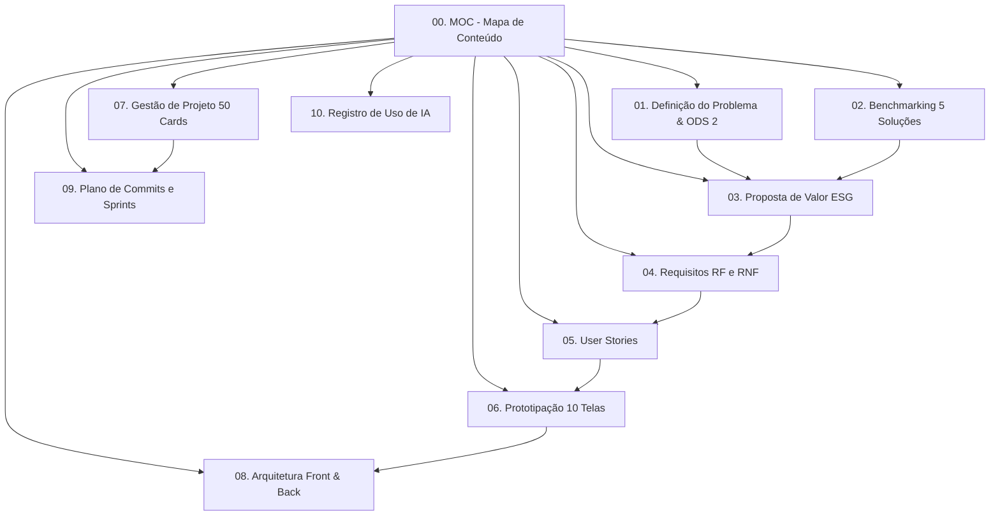

# 🌿 MOC — Rede Antidesperdício (Map of Content)

> **Projeto Hackathon — Frameworks Front-end**  
> **Tema Central:** [[01 - Definição do Problema e ODS|ODS 2: Fome Zero e Agricultura Sustentável]]  
> **Equipe (Grupo B):** Felipe Lopes, Anthony e Nicolas  
> **Tempo Limite de Desenvolvimento:** 3 Horas  
> **Deploy:** Front-end no **Vercel** | Back-end (API + SQLite) no **Render**

---

## 🧭 Navegação da Documentação (Obsidian Graph)

Este repositório de documentação foi arquitetado no padrão PKM (*Personal & Team Knowledge Management*) para ser visualizado tanto no **Obsidian** (com links bidirecionais `[[ ]]` e grafo dinâmico) quanto no **GitHub**.

---

## 📂 Índice Modular

1. **[[01 - Definição do Problema e ODS]]**
   - Fundamentação ESG, meta ODS 2.1, 2.2 e 12.3, dados da FAO/ONU e Lei Federal 14.016/2020 de combate ao desperdício.
2. **[[02 - Benchmarking de Soluções]]**
   - Análise crítica de 5 players de mercado (*Too Good To Go, Comida Invisível, Olio, Goodr, Connecting Food*) e matriz de diferenciais.
3. **[[03 - Proposta de Valor e Impacto ESG]]**
   - Resolução das 4 perguntas-chave do Hackathon, Canvas de Valor e Métricas de Impacto Socioambiental (CO2e mitigado, refeições salvas).
4. **[[04 - Requisitos do Sistema (RF e RNF)]]**
   - 10 Requisitos Funcionais (RF01 a RF10) e 10 Requisitos Não Funcionais (RNF01 a RNF10).
5. **[[05 - Histórias de Usuário (User Stories)]]**
   - 10 User Stories no formato ágil com critérios de aceitação BDD (*Given-When-Then*).
6. **[[06 - Prototipação e Arquitetura de Telas]]**
   - Wireframes conceituais e especificações das **10 telas obrigatórias**, paleta de cores biofílica e design responsivo.
7. **[[07 - Gestão do Projeto (50 Cards Kanban)]]**
   - Backlog granular com **50 cards reais** divididos por fases (Setup, Docs, Front-end, Back-end, Integração, Deploy, QA).
8. **[[08 - Arquitetura Técnica (Front Vercel & Back Render)]]**
   - Stack tecnológica: Framework Front-end (React/Next.js no Vercel), Backend Node/Express + SQLite no Render, modelagem de dados e endpoints REST.
9. **[[09 - Plano de Commits e Cronograma 3 Horas]]**
   - Estratégia de versionamento com **30+ commits semânticos** e divisão de tarefas para Felipe, Anthony e Nicolas no sprint de 3 horas.
10. **[[10 - Registro de Uso de Inteligência Artificial]]**
    - Metodologia de cocriação com IA, ferramentas utilizadas, prompts estruturados e governança.

---

## ⚡ Metas Críticas para as 3 Horas

| Entregável | Meta Hackathon | Status | Responsável |
| :--- | :--- | :--- | :--- |
| **Front-end Funcional** | Aplicação responsiva, rica e interativa | 🟡 Em planejamento | Grupo B |
| **Back-end SQLite** | API simples CRUD no Render | 🟡 Em planejamento | Back-end |
| **Deploy Ativo** | Vercel (Front) + Render (Back) | 🟡 Em setup | DevOps |
| **Commits Git** | Mínimo 30 commits significativos | 🟢 Iniciado (docs) | Todos |
| **Cards de Projeto** | Mínimo 50 cards categorizados | 🟢 Concluído | Docs |
| **Protótipo / Telas** | Mínimo 10 telas documentadas/implementadas | 🟢 Concluído | Docs / Front |
