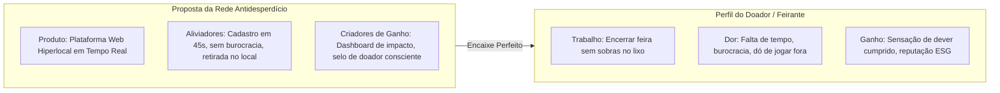

# 💎 03 - Proposta de Valor e Impacto ESG

> Documento base para a **Etapa 3 da Avaliação do Hackathon**.  
> Navegação: [[02 - Benchmarking de Soluções|Benchmarking]] | Próximo: [[04 - Requisitos do Sistema (RF e RNF)|Requisitos]]

---

## 🎯 1. Respostas Estratégicas às 4 Perguntas Essenciais

### ❓ Qual problema resolvemos?
Resolvemos o **descompasso logístico e informacional de última hora** entre o desperdício de alimentos frescos (hortifrúti, pães e alimentos preparados) nos pontos de venda locais e a crônica escassez de suprimentos nas cozinhas comunitárias e ONGs de assistência social. Transformamos o que seria custo de descarte e emissão de gases de efeito estufa em segurança alimentar para pessoas vulneráveis.

### 👥 Para quem?
* **Para Doadores (Feirantes, Mercados de Bairro, Padarias e Restaurantes):** que têm excedente não vendido, mas não querem que alimentos próprios para consumo virem lixo, buscando praticidade operacional e responsabilidade socioambiental.
* **Para Receptores (Cozinhas Solidárias, ONGs, Abrigos e Bancos de Alimentos):** que precisam de alimentos nutritivos diários com urgência e sem custos de aquisição.
* **Para a Sociedade e Meio Ambiente:** redução da sobrecarga dos aterros municipais e da pegada de carbono.

### 🚀 Como nossa solução ajuda?
Nossa solução é uma **aplicação web moderna, rápida e intuitiva (PWA-ready)** que:
1. Permite ao doador anunciar um lote de excedente em **menos de 45 segundos** pelo celular (com categoria, peso estimado, foto e horário limite de retirada).
2. Notifica e exibe em um mural georreferenciado e filtrável as doações ativas para as ONGs cadastradas.
3. Permite a reserva instantânea em **1 clique**, gerando um código de coleta seguro.
4. Calcula e exibe instantaneamente os indicadores de impacto gerados (kg salvos, pratos servidos, $CO_2$ evitado).

### 📈 Qual valor ela entrega?
* **Valor Social:** Alimento fresco e de alto valor nutricional na mesa de quem tem fome (ODS 2.1 e 2.2).
* **Valor Ambiental:** Redução direta da decomposição orgânica de metano ($CH_4$) em lixões e aterros (ODS 12.3 e ODS 13).
* **Valor Operacional/Econômico:** Redução de taxas de caçamba e descarte para comerciantes e economia orçamentária direta para as ONGs.
* **Valor de Governança e Transparência (ESG):** Certificados e métricas públicas auditáveis de responsabilidade social corporativa e comunitária.

---

## 📐 2. Value Proposition Canvas (Matriz de Proposta de Valor)

---

## 🌳 3. Algoritmo de Cálculo de Impacto ESG (Implementado no Front-end)

A aplicação traz como diferencial técnico um **Mecanismo de Métricas ESG em Tempo Real**, alimentado pelos seguintes coeficientes científicos:

$$1\text{ kg de Alimento Salvo} \approx 2{,}5\text{ kg de } CO_2\text{e evitados (Fonte: WRAP/FAO)}$$
$$1\text{ kg de Alimento Salvo} \approx 2\text{ refeições nutritivas balanceadas (400g a 500g)}$$
$$1\text{ kg de Alimento Salvo} \approx 450\text{ litros de água virtual poupada na cadeia produtiva}$$

Esses dados são renderizados na interface em forma de contadores dinâmicos, gráficos e selos de impacto ecológico.

---

## 🔗 Próximos Passos
- Especificação de Engenharia: [[04 - Requisitos do Sistema (RF e RNF)]]
- Histórias com Usuários: [[05 - Histórias de Usuário (User Stories)]]
