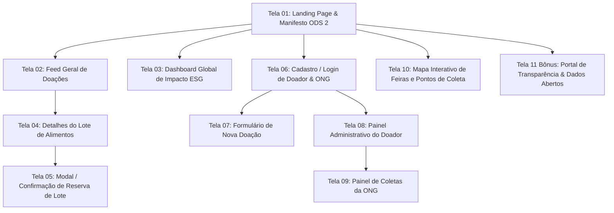

# 🎨 06 - Prototipação e Arquitetura de Telas

> Documento base para a **Etapa 6 da Avaliação do Hackathon** (Exigência: **Mínimo de 10 telas**).  
> Navegação: [[05 - Histórias de Usuário (User Stories)|User Stories]] | Próximo: [[07 - Gestão do Projeto (50 Cards Kanban)|Gestão Kanban]]

---

## 🗺️ 1. Fluxo de Navegação Geral da Aplicação

---

## 📱 2. Detalhamento e Wireframes das 10 Telas Obrigatórias

---

### 🖥️ Tela 01: Landing Page Institucional & Manifesto ODS 2
* **Objetivo:** Apresentar a causa, sensibilizar a comunidade, apresentar os pilares ESG e disponibilizar CTAs claros para "Quero Doar Alimentos" e "Sou uma ONG / Quero Resgatar".
* **Componentes Principais:**
  - Header fixo com logo biofílica, links e botão de alternância de contraste.
  - Hero section com foto real e slogan inspirador: *"Onde a sobra vira prato. Do feirante à mesa de quem precisa."*
  - Banner com métricas rápidas (kg salvos, refeições distribuídas).
  - Seção explicativa da Lei Federal 14.016/2020 (segurança para doadores).
  - Footer com links institucionais e selos ODS 2 e ODS 12.

---

### 🥗 Tela 02: Feed / Catálogo de Doações em Tempo Real
* **Objetivo:** Listagem visual de todos os lotes de alimentos ativos, filtráveis e atualizados em tempo real.
* **Componentes Principais:**
  - Barra de busca com input de texto e filtros rápidos por pílulas (*Hortifrúti, Padaria, Refeição, Mercearia*).
  - Filtro por proximidade e por status (*Disponíveis, Urgentes, Reservados*).
  - Grade responsiva de **Cards de Doação**:
    - Tag de categoria com cor semântica;
    - Foto do lote;
    - Título (ex: *"Caixa de Tomates e Folhagens - Feira Vila Madalena"*);
    - Peso aproximado (ex: *"18 kg"*);
    - Badge de urgência com contagem regressiva (*"Retirar até 14:30 - Restam 45 min"*);
    - Botão CTA: *"Ver Detalhes / Reservar"*.

---

### 📊 Tela 03: Dashboard Global de Impacto Socioambiental (ESG Analytics)
* **Objetivo:** Painel visual rico de métricas científicas de impacto gerado pela rede para patrocinadores, poder público e sociedade.
* **Componentes Principais:**
  - 3 Big Numbers (KPIs com animação de contagem):
    - 🥗 **Total de Kg de Alimentos Resgatados**
    - 🍲 **Refeições Nutritivas Equivalentes**
    - 📉 **Kg de $CO_2$e Mitigados de Aterros**
  - Gráfico de barras com distribuição de alimentos por categoria.
  - Gráfico de linha demonstrando o crescimento acumulado das doações.
  - Tabela com os Top 5 feirantes/restaurantes mais solidários do mês.

---

### 📦 Tela 04: Detalhes do Lote de Alimentos
* **Objetivo:** Exibir todas as informações sanitárias, horários, localização e instruções para retirada do alimento.
* **Componentes Principais:**
  - Carrossel de fotos do alimento.
  - Ficha técnica: Tipo de alimento, peso, condições de armazenamento (temperatura ambiente, refrigerado), data e hora de colheita/preparo.
  - Card com dados do estabelecimento doador (Nome, endereço da barraca/loja, horário limite improrrogável).
  - Selo de integridade e declaração de boas condições de consumo.
  - Botão de ação primária: *"Reservar Este Lote Imediatamente"*.

---

### 🎟️ Tela 05: Modal / Tela de Confirmação e Código de Resgate
* **Objetivo:** Garantir a reserva exclusiva do lote para a ONG e fornecer o código de segurança para coleta física.
* **Componentes Principais:**
  - Mensagem de sucesso com microanimação (Checkmark verde vibrante).
  - **Código de Coleta em Destaque:** (ex: `#REDE-7201`) em caixa de alta legibilidade.
  - Botão de "Copiar Código" e link direto para rota no Google Maps.
  - Instruções de retirada e botão para abrir conversa com o doador via WhatsApp.

---

### 📝 Tela 06: Cadastro / Autenticação (Doador vs. ONG)
* **Objetivo:** Interface unificada e simplificada de entrada no sistema.
* **Componentes Principais:**
  - Seletor de Perfil em dois cards visuais:
    - 🍎 *"Quero Doar (Feirante, Mercado ou Restaurante)"*
    - 🤝 *"Quero Receber (ONG, Cozinha Solidária ou Abrigo)"*
  - Formulário enxuto com validações em tempo real:
    - Nome / Razão Social, E-mail / WhatsApp, Endereço de referência, Senha.
  - Termo de concordância com as regras de segurança alimentar da Lei 14.016/2020.

---

### ➕ Tela 07: Formulário Ultra-Ágil de Nova Doação (Mobile-First)
* **Objetivo:** Permitir ao feirante publicar um lote em menos de 45 segundos no encerramento da feira.
* **Componentes Principais:**
  - Seletor de categoria em ícones grandes (🍎 Hortifrúti | 🍞 Padaria | 🍲 Comida Pronta | 📦 Grãos).
  - Campo de quantidade em KG ou caixas com botões rápidos (+5kg, +10kg, +20kg).
  - Seletor de horário limite de retirada com botões de atalho: *"Hoje às 14:00"*, *"Hoje às 15:00"*, *"Hoje às 18:00"*.
  - Upload rápido de foto ou seleção de ilustrações pré-definidas de hortifrúti.
  - Botão gigante de submissão: *"🚀 Publicar Doação Agora"*.

---

### 🧑‍💼 Tela 08: Painel Administrativo do Doador (Meus Anúncios)
* **Objetivo:** Gestão dos lotes cadastrados pelo doador, com controle de status e histórico de contribuição.
* **Componentes Principais:**
  - Abas de status: *Ativos (1)* | *Aguardando Retirada (2)* | *Concluídos (14)*.
  - Lista de lotes com ação de "Confirmar Retirada" mediante inserção do código da ONG.
  - Card de reputação do estabelecimento com seu total pessoal de quilos doados e selo para imprimir e colar na barraca de feira.

---

### 🏢 Tela 09: Painel da ONG (Minhas Reservas e Logística)
* **Objetivo:** Controle das coletas em andamento pela equipe de voluntários da instituição.
* **Componentes Principais:**
  - Relação de doações reservadas com contagem regressiva de tempo para expirar a tolerância de retirada.
  - Botão de "Compartilhar Rota com Motorista / Voluntário".
  - Histórico de entidades parceiras que mais apoiam a instituição.

---

### 📍 Tela 10: Mapa Interativo de Feiras e Pontos de Coleta
* **Objetivo:** Visualização geoespacial das feiras livres do município e das doações ocorrendo no dia.
* **Componentes Principais:**
  - Mapa interativo (renderizado com pins customizados verdes para doações disponíveis e laranjas para reservas).
  - Card deslizante inferior (*Bottom Sheet*) com resumo do ponto clicado.
  - Filtro por raio de busca (1 km, 3 km, 5 km, 10 km).

---

## 🎨 3. Design System & Identidade Visual ESG Biofílica

* **Paleta de Cores Sustentável:**
  - Primária (Verde Floresta ESG): `#10B981` / `#047857` (vitalidade, renovação, ODS 2).
  - Secundária (Terra Quente / Alimento): `#F59E0B` / `#D97706` (colheita, energia solar, calor humano).
  - Alerta / Urgência: `#EF4444` (alimentos com prazo de vencimento em menos de 1h).
  - Neutros: Fundo suave `#F8FAFC`, Superfícies `#FFFFFF`, Textos em `#0F172A` para contraste absoluto (Acessibilidade WCAG AA).
* **Tipografia:** Google Fonts `Outfit` (Headings expressivos e acolhedores) + `Inter` (Corpo técnico, numérico e de alta legibilidade).
* **Iconografia:** Lucide Icons (ícones nítidos e padronizados).
