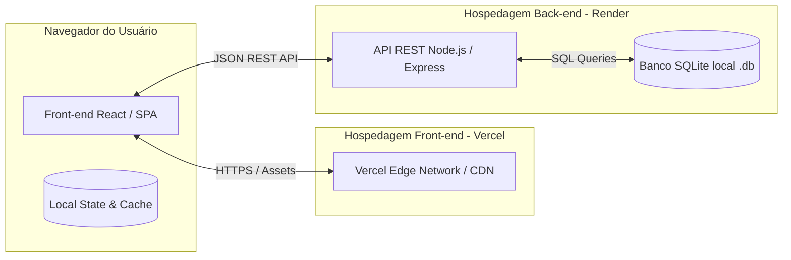

# 🏗️ 08 - Arquitetura Técnica do Sistema

> Documento base para a **Etapa 8 e 10 da Avaliação do Hackathon**.  
> Navegação: [[07 - Gestão do Projeto (50 Cards Kanban)|Gestão Kanban]] | Próximo: [[09 - Plano de Commits e Cronograma 3 Horas|Plano de Commits]]

---

## 🏛️ 1. Diagrama de Arquitetura de Alto Nível



---

## 💻 2. Stack Tecnológica Detalhada

### Front-end (Foco em Complexidade e Excelência Visual)
* **Framework:** Next.js (React) com App Router e Server/Client Components.
* **Estilização & Design System:** Vanilla CSS com Design Tokens modernos / CSS Modules (variáveis para cores biofílicas, dark/light contrast, glassmorphism e microanimações fluidas).
* **Ícones:** Lucide React (ícones semânticos, leves e de alto padrão).
* **Roteamento & Telas:** Roteamento por abas/páginas SPA com estado centralizado para garantir velocidade e ausência de recarregamento.
* **Hospedagem:** **Vercel** (Deploy contínuo via GitHub, CDN global, HTTPS automático).

### Back-end (Foco em Simplicidade, Leveza e Resiliência)
* **Runtime:** Node.js (v20+ LTS).
* **Framework:** Express.js (mínimo, rápido e desacoplado).
* **Banco de Dados:** **SQLite** (armazenado em arquivo local `data/database.sqlite`, garantindo portabilidade sem custos ou dependência de servidores complexos).
* **CORS:** Configurado para aceitar requisições do domínio Vercel e localhost.
* **Hospedagem:** **Render** (Web Service gratuito com suporte nativo a Node.js).

---

## 🗄️ 3. Modelagem de Dados SQLite

### Tabela `donations` (Doações de Alimentos)
```sql
CREATE TABLE IF NOT EXISTS donations (
    id INTEGER PRIMARY KEY AUTOINCREMENT,
    title TEXT NOT NULL,
    category TEXT NOT NULL,          -- 'hortifruti', 'padaria', 'refeicao', 'mercearia'
    quantity_kg REAL NOT NULL,        -- Peso estimado em quilos
    donor_name TEXT NOT NULL,         -- Nome da barraca / restaurante
    donor_type TEXT NOT NULL,         -- 'Feirante', 'Restaurante', 'Supermercado'
    location TEXT NOT NULL,           -- Endereço ou feira (ex: "Feira Livre Sumaré")
    phone_contact TEXT NOT NULL,      -- Telefone para contato após reserva
    expiry_time TEXT NOT NULL,        -- Horário limite (ex: "14:30")
    status TEXT DEFAULT 'DISPONIVEL', -- 'DISPONIVEL', 'RESERVADO', 'CONCLUIDO'
    reservation_code TEXT,            -- Código de resgate (ex: "REDE-9412")
    reserved_by_ong TEXT,             -- Nome da instituição que reservou
    image_url TEXT,                   -- Foto ou ilustração representativa
    created_at DATETIME DEFAULT CURRENT_TIMESTAMP
);
```

### Tabela `ongs` (Instituições Beneficiárias)
```sql
CREATE TABLE IF NOT EXISTS ongs (
    id INTEGER PRIMARY KEY AUTOINCREMENT,
    name TEXT NOT NULL,
    leader_name TEXT NOT NULL,
    capacity_daily INTEGER NOT NULL,  -- Capacidade de refeições diárias
    phone TEXT NOT NULL,
    neighborhood TEXT NOT NULL
);
```

---

## 📡 4. Contrato da API RESTful (Endpoints)

| Método | Rota | Descrição | Corpo da Requisição (Payload) | Resposta |
| :---: | :--- | :--- | :--- | :--- |
| `GET` | `/api/health` | Healthcheck do servidor no Render | N/A | `{ status: "ok" }` |
| `GET` | `/api/donations` | Lista todos os lotes (suporta `?category=` e `?status=`) | N/A | Array de doações |
| `POST` | `/api/donations` | Cadastra novo lote de alimentos doados | JSON com título, categoria, kg, etc. | Objeto criado com `id` |
| `PATCH` | `/api/donations/:id/reserve` | Reserva um lote para uma ONG | `{ ong_name: "Cozinha da Esperança" }` | `{ status: "RESERVADO", code: "REDE-4819" }` |
| `PATCH` | `/api/donations/:id/complete` | Conclui e dá baixa na entrega física | `{ code: "REDE-4819" }` | `{ status: "CONCLUIDO" }` |
| `GET` | `/api/metrics/esg` | Retorna métricas globais consolidadas | N/A | `{ total_kg: 420, meals: 840, co2_avoided: 1050 }` |

---

## 🚀 5. Estratégia de Deploy

1. **Deploy no Render (Back-end):**
   - Criação de novo Web Service conectado ao repositório GitHub.
   - Build command: `npm install`
   - Start command: `node server.js`
   - Configurar variável de ambiente `PORT=3001`.
2. **Deploy no Vercel (Front-end):**
   - Importar o projeto no dashboard do Vercel.
   - Variável de ambiente `NEXT_PUBLIC_API_URL=https://rede-antidesperdicio-api.onrender.com`.
   - Deploy automático a cada push na branch principal.
