# ⏱️ 09 - Plano de Commits e Cronograma de 3 Horas

> Documento base para a **Etapa 9 da Avaliação do Hackathon** (Exigência: **Mínimo de 30 commits significativos**).  
> Navegação: [[08 - Arquitetura Técnica (Front Vercel & Back Render)|Arquitetura Técnica]] | Próximo: [[10 - Registro de Uso de Inteligência Artificial|Uso de IA]]

---

## ⏳ Cronograma Estratégico do Sprint de 3 Horas

Com o tempo estrito de **3 horas**, a divisão tática entre **Felipe**, **Anthony** e **Nicolas** foi desenhada para paralelizar esforço e atingir 100% dos critérios avaliativos:

```mermaid
gantt
    title Cronograma de 3 Horas do Hackathon (Grupo B)
    dateFormat  HH:mm
    axisFormat  %H:%M
    
    section Hora 1 (00:00 - 01:00)
    Estruturação Docs Obsidian & Repositório :active, 00:00, 00:25
    Setup Front-end Vite React + Design Tokens : 00:20, 00:50
    Setup Back-end Express + SQLite + Seeds : 00:25, 01:00
    
    section Hora 2 (01:00 - 02:00)
    Implementação Componentes Front (Cards, Feed) : 01:00, 01:40
    Endpoints CRUD e Rotas REST no Backend : 01:00, 01:30
    Dashboard ESG e Contadores Animados : 01:30, 02:00
    
    section Hora 3 (02:00 - 03:00)
    Integração Front-Back & Modais de Reserva : 02:00, 02:30
    Deploy no Vercel (Front) e Render (Back) : 02:20, 02:45
    Revisão de Acessibilidade, Testes e README Final : 02:45, 03:00
```

---

## 📜 Relação de 32 Commits Semânticos Planejados

Abaixo está o mapa de commits reais e modulares para cumprir com rigor a exigência de **30+ commits significativos**:

### Bloco A: Documentação e Governança (Commits 01 a 08)
1. `docs: inicializa estrutura de documentação no formato obsidian`
2. `docs: detalha problema de desperdício de alimentos e alinhamento com ods 2`
3. `docs: adiciona benchmarking comparativo de 5 soluções do mercado`
4. `docs: define proposta de valor e formulação de métricas esg`
5. `docs: especifica 10 requisitos funcionais e 10 requisitos não funcionais`
6. `docs: elabora histórias de usuário com critérios de aceitação bdd`
7. `docs: mapeia arquitetura de 10 telas e wireframes da aplicação`
8. `docs: cadastra backlog com 50 cards no quadro kanban do projeto`

### Bloco B: Engenharia Back-end & SQLite (Commits 09 a 15)
9. `feat(server): inicializa api express com suporte a cors e json`
10. `feat(database): configura banco sqlite e migração da tabela donations`
11. `feat(database): adiciona seed inicial com dados realistas de feirantes e ongs`
12. `feat(api): implementa rota get /api/donations com filtros de categoria`
13. `feat(api): implementa rota post /api/donations para novo lote de alimentos`
14. `feat(api): implementa rota patch /api/donations/:id/reserve com gerador de código`
15. `feat(api): adiciona rota get /api/metrics/esg para consolidação de impacto`

### Bloco C: Engenharia Front-end & UI (Commits 16 a 26)
16. `feat(ui): inicializa projeto react com vite e estrutura modular`
17. `style(theme): cria design tokens com paleta biofílica esg e tipografia outfit`
18. `feat(ui): implementa navbar de navegação com badges e logo responsivo`
19. `feat(ui): implementa hero banner institucional com manifesto fome zero`
20. `feat(ui): cria componente donationcard com tags de urgência e categoria`
21. `feat(ui): implementa feed com grade responsiva e barra de pesquisa reativa`
22. `feat(ui): desenvolve filtros interativos por tipo de alimento e status`
23. `feat(ui): constrói formulário mobile-first de cadastro de doação para feirantes`
24. `feat(ui): implementa modal de reserva com geração de código de resgate`
25. `feat(ui): implementa dashboard esg com contadores animados de kg e co2`
26. `feat(ui): adiciona visualização conceitual de mapa de feiras livres`

### Bloco D: Integração, Deploy & Acabamento (Commits 27 a 32)
27. `feat(integration): conecta cliente react com os endpoints da api rest`
28. `fix(ui): adiciona skeletons de carregamento e tratamento de estado offline`
29. `style(a11y): aprimora contraste de cores wcag aa e foco em elementos interativos`
30. `ci(deploy): configura arquivos de ambiente e rotas para deploy no vercel`
31. `ci(render): adiciona configurações de start e variáveis para o render`
32. `docs: finaliza readme principal com urls de deploy e relatório de ia`
